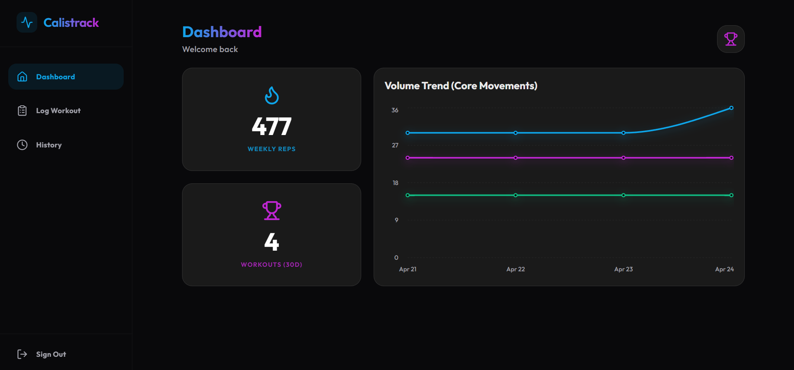

# ⚡ Calistrack - Full-Stack Fitness PWA


**Calistrack** is a high-performance, mobile-first Progressive Web App (PWA) designed specifically for logging bodyweight training routines, tracking volume progression, and managing workouts with real-time cloud synchronization.

---

### 💡 Why Calistrack?

Generic fitness apps are often cluttered and overly complex. Calistrack delivers a focused, distraction-free environment for calisthenics athletes. By combining a sleek dark-mode UI with a robust Firebase backend, it ensures users can seamlessly log their reps, track their weekly volume, and hit their goals without friction across any device.

---

### 🚀 Key Features

- **Secure Authentication:** User management and protected routes powered by **Firebase Auth**.
- **Real-time Cloud Sync:** Instant CRUD operations and seamless UI updates via **Firebase Firestore** listeners.
- **Volume Analytics:** Interactive dashboards tracking weekly reps and core movement trends using **Recharts**.
- **PWA Native Experience:** Installable on mobile devices for an app-like experience with offline caching capabilities.
- **Integrated Rest Timer:** Zero-dependency, highly accurate workout rest timer utilizing the native browser **Web Audio API**.
- **Intelligent Loading:** Custom skeleton states and robust caching logic to eliminate UI flickering and layout shifts.

---

### 🎨 UI/UX Highlights

- Premium "Flat Dark Mode" aesthetic inspired by modern SaaS dashboards.
- Mobile-first responsive architecture designed for one-handed gym use.
- Highly focused, centralized authentication flows.
- Instant visual feedback and dynamic data updates without page reloads.

---

### 🛠️ Technical Implementation

- **Frontend:** React (Hooks + Functional Components)
- **Styling:** Tailwind CSS for rapid, utility-first responsive design
- **Backend / BaaS:** Firebase (Authentication & Cloud Firestore)
- **Data Visualization:** Recharts for dynamic, responsive graphing
- **Build Tool:** Vite for lightning-fast HMR and optimized production builds
- **Data Flow:** Advanced `useEffect` lifecycle management and composite database indexing

---

### 📸 Preview



---

### 📥 Installation

```bash
# Clone the repository
git clone [https://github.com/Afsal-Palliyal/calistrack-workouts.git](https://github.com/Afsal-Palliyal/calistrack-workouts.git)

# Navigate into the directory
cd calistrack-workouts

# Install dependencies
npm install

# Start the development server
npm run dev

```

Note: To run this project locally, you will need to add your own /.env.local file containing your Firebase configuration keys.
